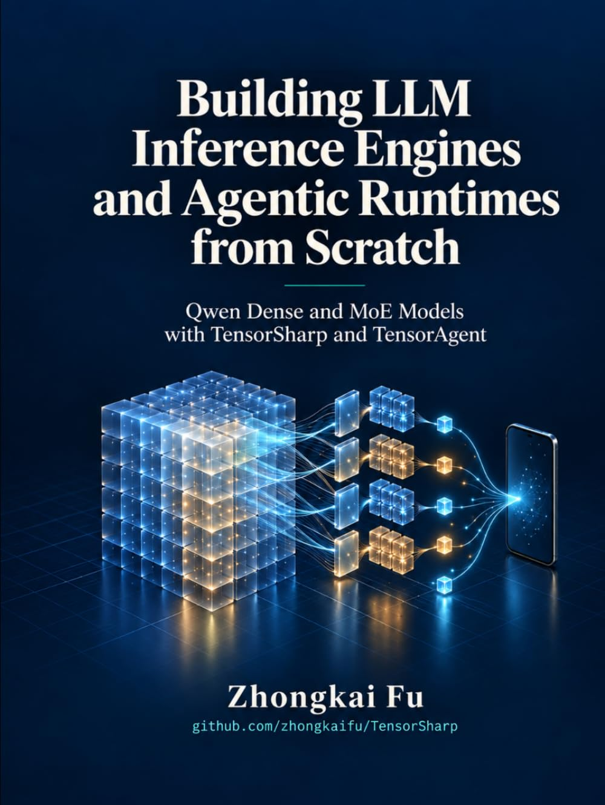

# TensorSharp

## Native compilation is explicit

Managed `dotnet build`, `test`, `publish` and `pack` do not compile GGML, MLX or CUDA code by default.
A missing native binary does not trigger compilation. Ordinary source builds need no native toolchain.
Native-backed inference needs a separately prepared native binary at runtime.

After the owner requests native compilation, enable only the required backend:

- GGML: `-p:TensorSharpBuildGgmlNative=true`.
- MLX: `-p:TensorSharpBuildMlxNative=true` (or `TENSORSHARP_MLX_NATIVE_BUILD=true`).
- CUDA PTX: `-p:TensorSharpBuildCudaNative=true`.

Backend options such as `TENSORSHARP_GGML_NATIVE_ENABLE_CUDA=ON` select the native build configuration;
they do not enable compilation. The existing native-skip switches take precedence over an opt-in.
Managed builds neither create a native NuGet package nor fetch a native build into a worktree.


<p align="center">
  
</p>

[English](README.md) | [中文](README_zh-cn.md)

**Native .NET LLM inference engine for GGUF models** — autoregressive LLMs *and* DiffusionGemma-style text-diffusion, plus [Qwen-Image-2.1 generation and editing](docs/models/qwenimage21.md) and MiniMax-H3 video with native 32 kHz stereo audio (and Wan 2.1/2.2 for video alone). Ships a console app, a browser chat UI, and Ollama/OpenAI-compatible HTTP APIs. The .NET runtime offers managed CPU and native accelerator backends; published comparisons use identical GGUF files and hardware. The optional `TensorSharp.AgentHost` layer adds Agent Skills and a bounded, in-process model-to-tool loop for sandboxed file and shell work.

## Supported model families at a glance

- **Text, reasoning, and multimodal LLMs:** [DeepSeek V4 Flash](docs/models/deepseek4.md) / [V4.1 Flash](docs/models/deepseek41.md), [GLM 5.x](docs/models/glm.md), [Gemma 4](docs/models/gemma4.md), [Qwen 3.5 / 3.6](docs/models/qwen35.md), [Qwen 3.8 Flash Next](docs/models/qwen38-flash-next.md), [Bonsai (Qwen family)](docs/models/bonsai.md), [GPT OSS](docs/models/gptoss.md), [Nemotron-H](docs/models/nemotron.md), [Mistral 3](docs/models/mistral3.md), [Hunyuan Dense](docs/models/hunyuan-dense.md), and [Muse-Glimmer](docs/models/muse-glimmer.md).
- **Text diffusion:** [DiffusionGemma](docs/models/diffusiongemma.md), including [Jev typed decision inference](docs/models/jev.md) at `/v1/systemone`, over text or image state.
- **Image generation/editing and video generation:** [Qwen-Image-2.1](docs/models/qwenimage21.md), [MiniMax-H3 (video + stereo audio)](docs/models/minimax-h3.md), and [Wan 2.1 / 2.2](docs/models/wan.md).
- **Text and code embeddings:** BERT / XLM-R encoders — [Snowflake Arctic Embed L v2.0 and all-MiniLM-L6-v2](docs/embeddings.md).

Backend, modality, feature support, and validation coverage vary by model. See the [model cards](docs/models/README.md), [embedding guide](docs/embeddings.md), and [full architecture matrix](#supported-model-architectures) for details.

## Learn with the books

| Qwen inference and agentic runtimes | Gemma 4 and multimodal inference |
|---|---|
| <a href="https://www.amazon.com/dp/B0HJQ4VQ31"></a> | <a href="https://www.amazon.com/dp/B0H9P44QZZ"></a> |
| **[Building LLM Inference Engines and Agentic Runtimes from Scratch: Qwen Dense and MoE Models with TensorSharp and TensorAgent](https://www.amazon.com/dp/B0HJQ4VQ31)** | **[From Tensors to Tokens: Building a Multimodal LLM Inference Engine from Scratch with TensorSharp and Gemma 4 E4B](https://www.amazon.com/dp/B0H9P44QZZ)** |
| Build Qwen dense/MoE inference and controlled agent workflows in C#. Follow tensors, tokenization, attention, expert routing, quantization, and caching through GPU acceleration, multimodal execution, tools, skills, sandboxed code, and desktop/mobile deployment with TensorSharp and TensorAgent. | Build a multimodal inference engine in C#/.NET with Gemma 4 E4B, from tensors, GGUF model loading, quantization, and tokenization to text, image, video, and audio execution. Connect correctness checks and serving optimizations to the running TensorSharp code. |
| **[Buy on Amazon](https://www.amazon.com/dp/B0HJQ4VQ31)** | **[Buy on Amazon](https://www.amazon.com/dp/B0H9P44QZZ)** |

**[Explore both books and their repository reading paths](docs/BOOK.md)**

## Highlights

- **Text and code embeddings.** GGUF BERT/XLM-R encoders with OpenAI/Ollama batch embedding APIs for Snowflake Arctic Embed and MiniLM; see the [embedding guide](docs/embeddings.md).
- **Local, native .NET inference.** Run GGUF text and multimodal models from the CLI, browser UI, or Ollama/OpenAI-compatible APIs.
- **Broad model and media support.** Current source covers modern text models, vision/audio input, PDF, image generation/editing, and video generation; see the [model cards](docs/models/README.md).
- **Measured performance.** TensorSharp is benchmarked against `llama.cpp` on identical models and hardware. Results are specific to the measured model, backend, and workload. See the [benchmark report](docs/engine_comparison_report.md).
- **Agentic work, including iOS.** `TensorSharp.AgentHost` adds bounded Agent Skills, code tools, and [automatic subagent delegation](docs/multi_agent.md) with independent contexts and read-only defaults. [TensorAgent](TensorAgent/README.md) brings the same local chat and agent experience to iPhone and iPad using the iOS `ggml_metal` backend.
- **Production-friendly building blocks.** Continuous batching, paged/prefix-shared KV cache, speculative decoding, tensor parallelism, and configurable security boundaries are available when you need them. See [Features](FEATURES.md), [Usage](USAGE.md), and the [current project status](docs/PROJECT_STATUS.md).

The detailed implementation notes and historical benchmark claims have moved to the linked documentation so this page stays useful as a starting point.

## Managed Unsafe-Cleanup Observation

Core exposes `NativeRuntimeQuarantine.Observe()` and exact-exception-identity
`TryGetFailure` observations for process-scoped unsafe cleanup. Checked CUDA
context, stream, module, kernel, allocator and storage owners use this authority.
Allocator retirement checks actual storage reference ownership before cleanup.
Group and model cleanup share the same ownership census and restoration call.
The model census includes tensor-parallel replicas only when their lazy cache exists.
Models without replicas retain the same construction rollback and retirement path.
Cleanup uncertainty retains actual owners and fences the affected device.
The Qwen-Image-2.1 conditioner joins its vision tensors to the text model's actual
disposal census. The text model releases that child before its allocator, through
the same coordinated cleanup. A failed vision constructor remains attached before
acquisition, including an unpublished weight or displaced temporal-patch weight.
The conditioner reserves its own release-only handle before creating text. A failed text
constructor keeps its original model recovery carrier when no text returns. After text
returns, the conditioner handle owns text and any failed lazy vision child. Explicit release
checks vision release before text release; normal disposal never retries a prior failed cleanup.
Uncertain child cleanup retains the actual text owner through its existing failure fence.
The pipeline preserves operation and cleanup failures and skips dependent global buffer
cleanup while the acquired conditioner remains unreleased. Proven text release remains
complete after a later context-restoration error.
Standalone Qwen35-compatible, Mistral3, GlmNext and Gemma4 vision and Gemma4 audio encoders
reserve a release-only cleanup handle before file or tensor acquisition.
Failed construction releases the child's actual tensors and
reader without owning or fencing the borrowed allocator. CUDA completion uses the actual tensor
storages; GGML release uses its checked barrier and resource reservation. Cleanup failure preserves
both errors and the handle, and uncertain resource release prevents automatic replay. A file-only
cleanup refusal retains the file recipe without repeating proven tensor release. Gemma4 vision
retains either its GGUF or safetensors reader and invalidates GGML bindings before freeing tensors.
The recipe snapshots actual tensor identities before native effects. A typed MLX busy refusal
against a still-owned storage keeps recovery available for explicit release instead of declaring
an uncertain native release. Healthy refusal restores borrowed CUDA context after effects exit.
Whole-model cleanup uses the same actual-storage identity check. A storage-bound busy refusal
keeps model execution fenced and leaves explicit cleanup recovery available. It does not
publish an uncertain native release or release the model's remaining resources.
Qwen35, Qwen4Exp, Mistral3, GlmDsa and Gemma4 retain every vision child before its constructor acquires resources.
A successful construction publishes the active child; a failure leaves the previous
active child unchanged. Failed nested construction attempts the same checked child rollback
as standalone construction. An unresolved child handle blocks another load until explicit
release completes. A released failed child no longer blocks replacement. Uncertain child
cleanup fences the actual parent through its existing failure owner after native effects exit.
Parent retirement collects remaining partial and replaced children before the allocator.
Replacement does not immediately reclaim the previous child's memory. The active reference and retained collection
clear only after all child releases succeed.
Qwen35, Mistral3, GlmDsa and Gemma4 retain acquired constructor input files and unpublished weights
until checked release. One weight-publication helper preserves actual displaced weights
before replacing a dictionary entry. Qwen35 uses that same helper. Gemma4 includes pending
and displaced weights in its GGML binding invalidation and preserves its existing CPU
vision allocator for the direct CUDA language backend. Parent-owned Mistral validation
failure attempts checked child rollback without retiring the healthy language model.
Gemma4 audio children use the same pre-acquisition parent retention and weight-publication
recipe. Failed audio replacement preserves the previous active child. Qwen35 retains an
acquired projector file until checked construction rollback closes it; an unresolved close
remains reachable through the actual child handle. Audio and vision construction
do not acquire disposal authority over their borrowed allocators.
QwenImage21 retains lazy vision children in its owned collection before constructor work.
Its ready vision field publishes only after construction returns. Checked text-owned cleanup
collects every retained vision child and clears the collection only after their release succeeds.
Parent-owned GGUF readers attach to the child before opening their files. Split readers
reserve collection capacity and attach each sibling before opening it. Header or shard
parse failure preserves the actual readers for the child's coordinated release, including
readers whose constructors never return. Standalone readers still release on construction failure.
Gemma4's parent-owned safetensors reader uses the same pre-acquisition attachment. Its header
stream remains reachable after parse failure and clears only after successful close.
Qwen's direct-CUDA transpose cache removes the original weight binding only after its
checked release returns. A release error preserves that binding and the published replacement.
Media transpose, temporal patch, position and device RoPE caches retain unpublished tensors
and views in the child's pending/displaced carrier before initialization or copy. Cache entries
publish after checked temporary-view release. Gemma4 audio retains its position-projection
tensors through the same carrier. Failed work remains visible to coordinated child retirement.
MLX CPU fallback keeps input views, mapped CPU tensors and unreturned results in the
worker's existing resource carrier before conversion or dispatch. Duplicate arguments
share the same mapped view, and explicit output tensors retain their caller identity.
The worker completes temporary cleanup before transferring a new result. Failed cleanup
preserves the actual carrier and the operation error together with independent cleanup
errors. The fallback does not hold an ordinary native effect across managed callbacks.
CUDA allocation reclaims pooled memory only outside current-thread native effects.
A nested allocation OOM preserves its CUDA error and unwinds without collecting,
waiting for finalizers or retrying beneath the caller's admitted native frame.
GGML attaches its actual process, contexts, storages, groups, models and native
handles to the CUDA dependency authority after real CUDA intent or backend-bearing
discovery. Participating owners inherit established process CUDA dependence.
Compile-only discovery does not establish that dependence. Independent CPU,
Metal and Vulkan operations do not enter CUDA scopes unless the process has
established CUDA dependence. GGML retains its own poison authority, loaded native
identity, sticky backend selection and shutdown rules.

GGML physical memory release after potential native use reserves an exclusive
counted cleanup interval.
Returning a block to its pool remains nonphysical and barrier-free. Owner
registration completion uses the same counted admission without requiring other
native calls to finish. Failed cleanup retains actual owners, exact causes and
per-block release progress. GGML callback admission keeps its invocation counted
while suspending only the CUDA effect around borrowed callbacks.

Core's process slot uses protocol 2, including callback-aware MLX call and
destructive-release reservations. A process initialized with a different protocol
must restart; the slot is never migrated or reset. MLX storage registers its actual
owner in the shared runtime scope and uses the internal final-release
admission hook. Tensor disposal marks ownership released only after the reference
decrement succeeds. A refused admission preserves both references; native cleanup
failure after the decrement does not restore them. A reserved release refuses new
compiled-call admission until it settles. MLX storage waits for all used streams under
its exact reservation before checked array-reference release and host-mirror release.
Failed synchronization leaves both references intact and reports the synchronization stage.
Failed release retains the actual storage through the process authority; safe completion
removes its registration. Worker queue
rejection also records the unreleased owner, and synchronous worker errors retain their
originating exception stack. The actual MLX worker registers in the same runtime scope.
Ordinary synchronous native helpers enter an effect on the executing worker, including
reentrant array frees. Synchronous dispatch from a different worker beneath an active native effect
or compiled callback refuses before queueing. General managed `Invoke` calls do not hold
a native gate across trace callbacks. Compiled closure creation/application and checked
reference release use callback-aware leases. Managed tracing suspends the native monitor
without dropping its counted invocation. Failed framework cleanup retains the actual closure,
invocation vectors and array references. Native callbacks record their original errors
before returning; aggregation occurs after the callback. Compile/apply status checks preserve
the native-status failure alongside each recorded callback error. A successful native status
does not erase a callback failure. Each admitted ordinary/compiled
call installs its generation's error handler under the shared gate.
Only the native payload destructor releases its exact callback root, except failed import
binding before native adoption. Checked closure-reference release completes registration
only when that root is actually gone. A later payload destructor does not automatically
complete a pending registration; deferred payload completion remains unfinished.
The seven built-in activation traces and GELU helper retain their acquired intermediates and
unreturned outputs through the same worker-owned array carrier as basic operations. Callback
inputs remain borrowed from their existing invocation owner. Outputs transfer only after
checked intermediate cleanup succeeds, including allocation of the returned output collection.
Other trace delegates still require construction/replacement recovery; invocation retention
does not supply their missing intermediate ownership.
Graph evaluation, asynchronous submission and host-copy evaluation retain their actual vector
resources through the worker before native acquisition. Submission waits for checked native
return, not GPU completion. Failed evaluation retains the graph and fences the shared runtime;
checked vector cleanup preserves original operation and independent cleanup errors. Evaluation
view and cache-materialization carriers retain their actual acquired references on unsafe cleanup.
Fused evaluation helpers propagate recorded unsafe errors instead of reporting a healthy fallback.
Storage's native upload, flattened replacement and slice update use preinstalled recovery
carriers. Admitted handoffs consume the caller's reference explicitly by ref, including failure
after adoption; admission refusal preserves it. Basic, fused and quantized operations use one
storage handoff. Native factories used by storage retain outputs before status validation and
check temporary cleanup before returning an output. Failed cleanup retains actual storage,
incoming arrays and unreturned replacements; successful fields clear once, with no rollback.
Storage operations dispatch to the worker before taking their existing reference-mutation
gate. They recheck the actual storage under that gate and keep host copies, dirty-state
updates, array-view acquisition and result adoption inside it. Host element and byte ranges
reject overflowing ends before raw pointer access. Reference mutations from another thread
refuse beneath a native effect or compiled callback before waiting on the
storage gate. View acquisition and result adoption also check the actual tensor's live
ownership. Ref handoff preserves the caller's array when admission refuses and consumes it
only after the actual change carrier takes it. Raw returned pointers still require the caller
to keep their tensor alive; this path does not establish external no-copy backing lifetime
or qualify native concurrency/finalizer behavior.
Ordinary scalar, unary, binary, view, gather, normalization, attention and quantized-array
factories use the same recovery carrier for native outputs before validation. Concatenation
also owns its temporary native vector, checks its construction and release, and returns its
output only after safe vector cleanup. No-copy host buffers remain borrowed.
Basic operations retain acquired array references and their actual input/target storages in
preinstalled worker-owned carriers. Graph construction keeps native calls separately admitted
so compiled callbacks run without an outer ordinary native lease. Checked cleanup clears each
released reference once and preserves the original operation plus an independent cleanup
failure. Failed or refused cleanup retains the remaining references and storage graph. Empty
reference cleanup has no native effect. The eager GELU helper returns its output only after
all intermediate cleanup succeeds; failed cleanup retains its unreturned output.
Stateless fused operations use the same array carrier for acquired references and actual
input/target storages. Their Try paths return false after an operation error only when
cleanup succeeds, no target transfer completes and no recorded unsafe failure exists.
Multi-output handoffs record each successful target transfer; a later failure propagates
without rollback or fallback replay. Tensor materialization retains its view and contiguous
result through evaluation and storage adoption. Chunked prefill propagates operation errors
and refuses fallback after committing an attention block. Custom-kernel construction
references use a separate worker carrier.
Quantized operation callers retain acquired references, returned closure outputs and actual
borrowed weight/cache-entry objects through the same worker ownership collection. Three Q8
fast-path attempts receive isolated checked cleanup before another kernel runs; recorded
unsafe errors and completed target transfers prohibit fallback. The dense-FFN trace retains
its intermediates and unreturned result, allocates its output collection before transfer
readiness and returns only after checked cleanup. These carriers do not own cached weights,
compiled closures or external host buffers.
Five quantized-weight array factories install actual reference carriers before acquisition.
They retain partial arrays through evaluation and result construction, free only successful
references on failure and publish results after checked cleanup. Three staging paths retain
eight aligned-buffer slots and any unreturned weight in the worker's actual ownership graph.
Aligned frees clear only buffers whose release returns successfully. A recorded unsafe
failure prevents cleanup replay and preserves the actual remaining arrays, buffers and result.
Packing recipes and caller-owned no-copy backing remain unchanged. Construction recovery
does not establish external-backing lifetime or GPU completion.
One registered parent owns the ordinary and stacked weight dictionaries, offload LRU and existing byte
accounting. Lookup and mutation run on the worker before taking the existing cache lock.
Cold publication reserves the node and dictionary capacity before acquiring a weight.
The worker carrier retains the unreturned entry. A native ownership effect covers actual
dictionary/LRU publication; failed publication records CacheRelease and retains the graph.
The dictionary owns an entry as soon as insertion returns; later failure cannot free it
as an unpublished weight. Busy cleanup does not trigger quantized fallback.
Key release, device clearing and LRU eviction reserve the actual cache parent before
dispatch. Nonempty release waits for the real all-stream snapshot before freeing arrays.
Each successful free clears its field; dictionary/LRU/accounting changes follow checked
release. Partial failure retains the remaining entry and records its actual stage.
Stacked lookup and publication run on the worker before the cache lock. The real construction
carrier retains all arrays until the existing parent dictionary accepts the result. A second
lookup before acquisition reuses a concurrent winner without constructing a lost-race entry.
Publication and construction share one worker call; failed publication retains the actual
parent and remaining arrays. Per-key and device cleanup release both weight dictionaries
after the reserved all-stream boundary. Stacked cleanup clears only checked-success fields.
Stacked preload propagates Busy and retained unsafe failures without reporting fallback.
The registered parent also owns the actual dense-FFN closure dictionary. The worker retains
its real slot before closure creation, reserves dictionary capacity first and publishes
only after checked construction returns. Publication failure retains the actual graph.
Unpublished closure cleanup uses its own callback-aware release authority without an outer
ordinary native effect. Cache lookup, construction and publication share one worker call.
The seven built-in compiled slots belong to one registered parent and keep their existing
trace recipes. Their worker carriers retain each closure until slot publication succeeds.
Backend cache clearing keeps its destructive reservation through all-stream synchronization,
ends the ordinary effect, then releases built-in and dense-FFN cached closure references
through each actual closure's callback-aware authority. Cache fields and dictionary entries
clear only after checked release. Kernel, stream and allocator cleanup follows in a new
effect under the same worker reservation. A failed phase stops later cleanup.
Native data can retain a released closure's payload; its actual handle owner remains active
until the deferred payload is retired. Cache clearing does not establish final registration
retirement, queued-reader safety or complete worker/model cleanup.
The actual compiled closure remains in the worker's existing resource collection until its
registration is safely released. A preallocated callback notification posts retirement
without waiting beneath a native frame. The worker checks actual reference/payload receipts
before the next queued operation; empty-reference retirement performs no native free replay.
Healthy same-owner Busy retains the object for a later registration attempt. Callback and
dispatch failures remain on the real closure/work descriptor and propagate or log without
freeing the unsafe graph. Deferred callbacks borrow a call lease only on its owning thread.
Worker disposal queues one shared retirement action. Its publication fences new external
calls while accepted reentrant work finishes inline. The action closes the queue after prior
work drains and checks the actual retained resource collection. Concurrent and repeated
disposals observe that same completion and error, then join the actual worker thread.
Shutdown refuses self-join and cross-worker waits beneath native effects or compiled callbacks.
Quarantine does not prevent a control-only retirement wait or authorize new native effects.
Payload notifications during pending retirement leave their receipts on the actual holders
for its final scan. Notifications after completion reject and retain their dispatch failure.
Remaining native resources fail retirement and stay owned; thread exit does not report their
safe release. After that scan, retirement checks the actual seven compiled slots, ordinary
and stacked weight dictionaries, FFN closures, LRU/resident bytes, 59 kernel slots and stream
collection. Only empty owners complete their registrations through exact destructive
reservations. The worker completes its own registration last. Partial failure stops later
registration retirement; repeated disposal observes the original action without replay.
Queue/thread retirement does not clear native caches or coordinate live model/allocator
leases. It does not establish all-stream completion or native callback/finalizer/concurrency
qualification. Ordinary cache clearing leaves its reusable parent registrations active.
Built-in compiled activations and quantized cache consumers keep lookup and use in one
worker operation. Other queued cache clearing cannot release their entries between those
steps. Two-weight MoE and dense-FFN calls retain separate native array references before
loading the next weight; same-operation LRU eviction can release cache references without
invalidating those active inputs. The existing acquisition carriers own partial aliases,
and checked cleanup releases their actual references. This does not establish external
host-backing lifetime, concurrent storage disposal safety or complete worker retirement.
Allocator disposal sets its disposed flag only after device and backend cache cleanup
succeed. These operations do not establish final cache/closure/model/worker retirement,
queued-reader lifetime, external host-backing lifetime or native runtime qualification.
The attention KV cache registers its actual owner in the shared runtime scope. Append,
materialization, reset and disposal run on the worker. Cache replacement and release use
the owner's exact destructive reservation before freeing references; Busy preserves the
existing cache. Checked release clears each successful field once. Failed release retains
the actual cache and remaining temporary references, and propagates the original error.
Append retains its view, compact, concatenated and attention references in one carrier;
completed target or cache transfers prohibit fallback. Disposal completes registration
only after both references are released, and repeated successful disposal is a no-op.
Asynchronous materialization checks submission and reference replacement, not GPU completion.
The recurrent GatedDeltaNet cache registers its actual owner and reserves checked state
replacement, materialization, reset and disposal through the same runtime authority.
Reset preserves normalization weights; disposal releases them and completes registration
only after every owned reference is released. Failed cleanup retains the actual cache.
Packed and eager callers retain their references and compiled-normalization scalars in
worker-owned carriers. A separate packed-attempt carrier checks cleanup before eager fallback.
Target commits propagate through parent carriers and prohibit fallback replay. Normalization
weight replacement prepares its output before releasing the old reference. Scalar, activation
and depthwise-convolution helpers retain unreturned outputs and iteration references until
checked cleanup; a failed accumulator release is not retried during unwinding. Zero-state
initialization does not advance recurrence. Custom-kernel construction uses a separate
worker carrier.
All 44 custom-kernel config-owning application paths retain configs, input/output vectors,
ten scalar references and sixty extracted output references before validation. The existing
worker installs each carrier before acquisition. Checked cleanup clears only successful
releases, preserves original and independent cleanup errors, and retains the actual remaining
graph when unsafe. Single, tuple and multi-output methods return only after temporary cleanup
succeeds. IQ4_XS/Q5_K/Q6_K fallback catches propagate recorded unsafe errors. These application
carriers borrow cached kernels; they do not establish all-used-stream completion or
kernel-cache lifetime ownership.
All 53 cached-kernel construction sites use one checked factory. Its worker-installed
carrier retains input/output string vectors, unmanaged string buffers and the actual
kernel before validation. Appended strings are copied by the native vector before their
buffers are released. An early buffer-release failure records unsafe ownership before
unwinding, so cleanup does not retry it. Kernel results transfer only after temporary
cleanup succeeds. Failed cleanup retains the actual unreturned kernel and remaining
allocations. Safe unsupported construction preserves each kernel's disabled flag and
diagnostic, including the native error as its cause. The genuine native kernel free
returns void; its actual return releases the wrapper reference, not GPU work.
One registered owner holds all 59 cached kernel slots. Construction publishes directly to
those actual fields after checked temporary cleanup. Application carriers retain that parent
while borrowing its kernels. After all-stream synchronization, cache clearing reserves the
actual parent and checks each wrapper release under the existing kernel lock. Successful frees
clear only their fields. A later failure retains the actual remaining kernels and records
CacheRelease without clearing the allocator. Disabled flags and construction recipes remain
unchanged; successfully released slots can be recreated. The reusable owner stays registered
after cache clearing; this release does not establish final worker or generation retirement.
Kernel disable handlers and eight simdgroup fallback catches propagate recorded unsafe
failures without starting another kernel attempt.
Allocator-cache clearing reserves its actual worker through the shared process authority
before dispatch. Active compiled calls refuse that destructive reservation. The admitted
native phase synchronizes the real complete MLX stream snapshot before releasing owned
kernel and default-stream wrappers and clearing the allocator cache. TensorSharp's native extension
uses MLX's get_streams and synchronize APIs,
including CPU and GPU streams from other workers in the same native runtime. It does not
substitute the calling thread's default stream or a worker queue barrier.
Synchronization failure prevents cache clearing, records the Synchronization stage and
retains the actual worker graph. Stream-wrapper release failure records CacheRelease and
retains the actual remaining wrappers. A later clear failure records AllocatorRelease. These paths
preserve the original native cause and any independent publication error. Binding and native
cleanup failures propagate; an older library without the all-stream export is not accepted
as successful cache cleanup. Upstream MLX sources remain unchanged.
Device initialization retains the actual temporary device before native validation and
checks its release before publishing initialized-device readiness. Failure after default-device
selection records unsafe context state and requires process restart; initialization does not retry it.
Availability probing uses the same worker-owned device carrier and checked release. Native query
errors propagate through the existing decoder. A failed device release retains the actual device
and fences the shared runtime. Missing or incompatible libraries report unavailable only when no
probe device remains owned; they do not hide a failed release.
GPU initialization reports Metal as unavailable only after its native query succeeds with a
false result. A failed query preserves its native action, status and captured error through
the existing decoder.
Default-stream acquisition retains the actual C wrapper before validation. One registered
owner keeps cached and uncached wrappers until synchronized checked release. Cache invalidation
retains old wrappers; the uncached benchmark mode still acquires a fresh wrapper per operation.
Only successful frees clear owned references. Reusable stream-owner registration remains active
after cache clearing; wrapper release does not claim native stream or worker retirement.
Full retirement integration of all-used-stream synchronization remains unfinished.
Final cached-kernel owner retirement, raw temporaries,
other stateful fused operations, quantized caches, other trace callers, tensor-owned child disposal and replacement
paths still require checked ownership recovery;
worker admission does not prove successful GPU synchronization or worker retirement.
Remaining raw CUDA
paths do not gain ownership guarantees from it. `NoRecordedFailure` does not
certify availability, initialization or safe native cleanup. GGML integration
has production compilation and source-review evidence, not executed native or
device qualification. Protocol-2 MLX callbacks, checked backend retirement and
the final-release hook have no executed runtime qualification.

MLX's shared array-reference release helper waits for the native free and checks
its return status. Worker reentrant calls remain inline. Other raw native cleanup sites
and all-used-stream retirement are not covered by this helper.
Storage release checks the array reference, not GPU execution completion.

## Quick Start

Prefer a prebuilt application? The [Releases page](https://github.com/zhongkaifu/TensorSharp/releases) provides self-contained CLI and Server archives for Windows x64 (CPU/CUDA), Linux x64 (CPU/CUDA), and macOS arm64.

**NVIDIA DGX Spark / GB10:** use the separate experimental **CUDA 13, Linux ARM64**
[Docker build and archive instructions](DEVELOPMENT.md#gb10--dgx-spark-build-container-experimental).
Its archives end in `linux-arm64-cuda13-GB10`; they target a single GB10, not
generic ARM64 GPUs. CLI and server text inference have been checked on real
hardware. The existing x64 CUDA archives are not suitable for the Spark.

Source builds target .NET 10. On a new development machine, install the full **.NET 10 SDK**—the .NET Runtime alone cannot build TensorSharp:

| Platform | Install the SDK |
|---|---|
| **Windows** | In PowerShell, run `winget install Microsoft.DotNet.SDK.10`, or use Microsoft's [.NET installation guide for Windows](https://learn.microsoft.com/en-us/dotnet/core/install/windows). |
| **macOS** | Use the [.NET 10 SDK installer](https://dotnet.microsoft.com/en-us/download/dotnet/10.0): choose **Arm64** for Apple silicon or **x64** for an Intel Mac. See Microsoft's [macOS instructions](https://learn.microsoft.com/en-us/dotnet/core/install/macos). |
| **Linux** | Follow Microsoft's [Linux distribution guide](https://learn.microsoft.com/en-us/dotnet/core/install/linux) to configure the correct package source for your distro and install its .NET 10 SDK package (commonly `dotnet-sdk-10.0`). |

Open a new terminal and verify that a `10.0.x` SDK is listed:

```bash
dotnet --list-sdks
```

See the [cross-platform .NET install overview](https://learn.microsoft.com/en-us/dotnet/core/install/) or [Development → Prerequisites](DEVELOPMENT.md#prerequisites) for more detail.

Then get running in ~30 seconds on the verified native GGML fast path — Gemma 4 E4B. The other prerequisites are `git`, `curl`, [CMake](https://cmake.org/download/) 3.20+ (the native GGML library is configured and built with it — on Windows, Visual Studio's "C++ CMake tools for Windows" component ships one and the build will find it), and the toolchain for your GPU backend (see [Development → Prerequisites](DEVELOPMENT.md#prerequisites)). The recommended public file is [`gemma-4-E4B-it-Q8_0.gguf`](https://huggingface.co/ggml-org/gemma-4-E4B-it-GGUF/blob/main/gemma-4-E4B-it-Q8_0.gguf) (7.48 GiB); text-only inference needs no projector.

**Windows + NVIDIA (PowerShell)**

```powershell
git clone https://github.com/zhongkaifu/TensorSharp.git; Set-Location TensorSharp
New-Item -ItemType Directory -Force models | Out-Null
curl.exe -L --fail "https://huggingface.co/ggml-org/gemma-4-E4B-it-GGUF/resolve/main/gemma-4-E4B-it-Q8_0.gguf?download=true" -o models\gemma-4-E4B-it-Q8_0.gguf
'Answer in one short sentence: what is TensorSharp?' | Set-Content prompt.txt
$env:TENSORSHARP_GGML_NATIVE_ENABLE_CUDA = 'ON'
dotnet run --project TensorSharp.Cli -c Release -p:TensorSharpBuildGgmlNative=true -- --model models\gemma-4-E4B-it-Q8_0.gguf --input prompt.txt --max-tokens 128 --backend ggml_cuda
```

**macOS (Apple Silicon)** — drop the CUDA env var and use `--backend ggml_metal`.

**Linux + NVIDIA** — prefix the `dotnet run` with `TENSORSHARP_GGML_NATIVE_ENABLE_CUDA=ON` and use `--backend ggml_cuda`.

**AMD / Intel / NVIDIA Vulkan** — set `TENSORSHARP_GGML_NATIVE_ENABLE_VULKAN=ON` and use `--backend ggml_vulkan`.

**Linux (Ubuntu) + multiple NVIDIA GPUs — tensor parallelism**

Tensor parallelism splits one model across N GPUs. It runs on the direct
`cuda` backend and on the GGML CUDA / Vulkan backends (`--backend ggml_cuda`,
`ggml_vulkan`). Qwen 3.8 Flash Next and DeepSeek V4 use the same flag for a
layer split instead: one contiguous run of whole layers per GPU. GLM 5.x also
layer-splits by default when the flag is omitted, while `--tp N` selects its
native local tensor-parallel path on the GGML GPU backends. Install the CUDA
toolkit first, then:

```bash
# On RunPod's Ubuntu 24.04 images, point the loader at the CUDA compat libraries first:
export LD_LIBRARY_PATH=/usr/local/cuda-12.6/compat:$LD_LIBRARY_PATH
# On older Ubuntu releases the .NET 10 SDK comes from the backports PPA:
add-apt-repository ppa:dotnet/backports

apt update && apt install dotnet-sdk-10.0
git clone https://github.com/zhongkaifu/TensorSharp.git
cd TensorSharp
mkdir models
wget "https://huggingface.co/ggml-org/gemma-4-E4B-it-GGUF/resolve/main/gemma-4-E4B-it-Q8_0.gguf?download=true" -O models/gemma-4-E4B-it-Q8_0.gguf
bash TensorSharp.GGML.Native/build-linux.sh
dotnet build -c Release

# 2 GPUs in one process
TensorSharp.Cli/bin/TensorSharp.Cli --model models/gemma-4-E4B-it-Q8_0.gguf \
    --backend cuda --interactive --max-tokens 20000 --tp 2

# Same thing on the GGML CUDA backend (add TENSORSHARP_TP_DEVICES=0,2 to pick GPUs)
TensorSharp.Cli/bin/TensorSharp.Cli --model models/gemma-4-E4B-it-Q8_0.gguf \
    --backend ggml_cuda --interactive --max-tokens 20000 --tp 2
```

Scale the same model across machines by adding a node ID and the shared peer
list — 2 nodes × 2 GPUs gives a global TP degree of 4:

```bash
# Node 0
TensorSharp.Cli/bin/TensorSharp.Cli --model models/gemma-4-E4B-it-Q8_0.gguf --backend cuda --tp 2 \
    --tp-node-id 0 --tp-peers "192.168.1.10:9500,192.168.1.11:9500"
# Node 1 (same peer list, different node ID)
TensorSharp.Cli/bin/TensorSharp.Cli --model models/gemma-4-E4B-it-Q8_0.gguf --backend cuda --tp 2 \
    --tp-node-id 1 --tp-peers "192.168.1.10:9500,192.168.1.11:9500"
```

`TensorSharp.Server.Host` takes the same `--tp`, `--tp-node-id`, and `--tp-peers`
flags (or the `TENSORSHARP_TP_*` environment variables); in a multi-node
cluster the server is node `0` — the driver that serves HTTP — and every other
node runs a `TensorSharp.Cli` worker. Full reference:
**[Tensor Parallelism & Distributed Inference](USAGE.md#tensor-parallelism--distributed-inference)**.


Host the same model as a server (browser UI at <http://localhost:5000>, plus Ollama/OpenAI APIs):

```bash
dotnet run --project TensorSharp.Server.Host -c Release -p:TensorSharpBuildGgmlNative=true -- --model models/gemma-4-E4B-it-Q8_0.gguf --backend ggml_cuda --max-tokens 512
```

> The server binds `0.0.0.0:5000` by default (change it with `--port` / `--host`, or the `PORT` / `HOST` environment variables; on macOS port 5000 is taken by the AirPlay Receiver) with no built-in auth or TLS — keep it behind a firewall or an authenticated HTTPS reverse proxy. For image/video/audio add the companion [`mmproj-gemma-4-E4B-it-Q8_0.gguf`](https://huggingface.co/ggml-org/gemma-4-E4B-it-GGUF/blob/main/mmproj-gemma-4-E4B-it-Q8_0.gguf) with `--mmproj`.

TensorSharp.Server, TensorSharp.Cli, and TensorAgent use the shared engine's Radix
KV prefix cache by default for supported models. It reuses public prompt prefixes
and each conversation's private state, respecting model and media boundaries.
Set `TS_SCHED_PREFIX_CACHE=0` to disable runtime prefix reuse, or
`TS_PREFIX_CACHE_MODE=legacy` to select the compatibility path for diagnosis.
Server and CLI `--no-prefix-cache` also disable prefix reuse and startup warmup.

Both executables print their full option reference — description, default, range, and an example per flag — when started with no arguments or with `--help`:

```bash
dotnet run --project TensorSharp.Cli -c Release -- --help
dotnet run --project TensorSharp.Server.Host -c Release -- --help
```

Full command reference: **[CLI](USAGE.md#console-application)** · **[Server](USAGE.md#web-application)** · more models to download: **[Model Downloads](MODEL_DOWNLOADS.md)** · prefer a config file? **[config/](config/README.md)**.

## Text and code embeddings

Current source supports **Snowflake Arctic Embed L v2.0** and **all-MiniLM-L6-v2** GGUF encoders, serving normalized vectors through OpenAI `/v1/embeddings`, Ollama `/api/embed`, and legacy `/api/embeddings`. After the source build above, start the small MiniLM service:

```bash
curl --create-dirs -fL -o models/embeddings/all-MiniLM-L6-v2-Q8_0.gguf \
  https://huggingface.co/second-state/All-MiniLM-L6-v2-Embedding-GGUF/resolve/544f204f2eaa2d71361ffc74d6df7170285b286a/all-MiniLM-L6-v2-Q8_0.gguf
dotnet TensorSharp.Server.Host/bin/TensorSharp.Server.Host.dll \
  --model models/embeddings/all-MiniLM-L6-v2-Q8_0.gguf \
  --embeddings --backend cpu --host 127.0.0.1 --port 5001 --no-webui
```

```bash
curl http://127.0.0.1:5001/v1/embeddings -H 'Content-Type: application/json' \
  -d '{"model":"all-MiniLM-L6-v2-Q8_0","input":["read a file","open a document"]}'
```

Use `cpu` for 100% pure C# execution without native inference libraries, or `ggml_cpu`, `ggml_metal`, and `ggml_cuda` for native GGML execution; run chat and embedding services separately. See the [embedding guide](docs/embeddings.md) for Snowflake downloads, batching, dimensions, the C# API, tokenization, and performance validation.

## Pick a Backend

Backend support depends on the model architecture. Embedding models support pure C# `cpu` and native `ggml_cpu`, `ggml_metal`, and `ggml_cuda`; see the [status matrix](docs/PROJECT_STATUS.md#status-matrix) for other model-specific limits.

| Your hardware | Recommended backend | Flag | Notes |
|---|---|---|---|
| **Apple Silicon (Mac)** | GGML Metal | `--backend ggml_metal` | Default on macOS. `--backend mlx` is an alternative Apple-Silicon GPU path. |
| **Windows / Linux + NVIDIA GPU** | GGML CUDA | `--backend ggml_cuda` | Most-tested NVIDIA path. `--backend cuda` is the direct PTX/cuBLAS backend for experimentation. |
| **Windows / Linux + AMD / Intel / NVIDIA GPU** | GGML Vulkan | `--backend ggml_vulkan` | Vendor-neutral GPU path via ggml-vulkan. Built automatically when a Vulkan runtime is present; `--no-vulkan` opts out. |
| **No GPU / portability / debugging** | Pure C# CPU | `--backend cpu` | No native dependencies; matmuls run on a multi-core worker pool. Even DeepSeek V4.1 Flash has a whole-model executor here — it runs on the pure-C# `DeepSeek4CpuExecutor` with no ggml and no GPU, held to the PyTorch oracle `eng/dsv41-reference.py` at `atol=rtol=2e-5` on a five-layer F32 fixture (architectural agreement with the oracle, not parity on the real Q2_K weights), as a correctness and portability path rather than a serving one. For faster CPU inference use `--backend ggml_cpu` (native kernels). |

Full per-backend description: [Usage → Compute Backends](USAGE.md#compute-backends).

## Verified Models

Implemented and exercised by the test/benchmark matrix. Pick a quantization that fits your hardware (Q4_K_M for low memory, Q8_0 for higher quality). More sizes and projector files: [Model Downloads](MODEL_DOWNLOADS.md).

| Family | Example model (GGUF) | Image / Video / Audio | Thinking | Tools | Card |
|---|---|---|---|---|---|
| DeepSeek V4.1 Flash | [DeepSeek-V4.1-Flash](https://huggingface.co/vcruz305/DeepSeek-V4.1-Flash-GGUF/tree/58d8ac86298fdf85a2440defee08b1abcad32e45) (Q2_K or Q4_K_M shards with embedded Engram; `ggml_cuda` serving path, with `ggml_cpu` a correctness and portability path that still takes the vision companion, and `cuda` and the pure-C# `cpu` executor text-only ones) | ✅ (vision companion) / ✅ (vision companion) / — | ✅ | ✅ | [deepseek41.md](docs/models/deepseek41.md) |
| DeepSeek V4 Flash | [DeepSeek-V4-Flash-0731](https://huggingface.co/unsloth/DeepSeek-V4-Flash-0731-GGUF) (284B MoE, split GGUF) | — / — / — | ✅ | ✅ | [deepseek4.md](docs/models/deepseek4.md) |
| GLM 5.x | [GLM-5.2](https://huggingface.co/unsloth/GLM-5.2-GGUF) (744B-A40B MoE, split GGUF), [GLM-5.3](https://huggingface.co/unsloth/GLM-5.3-GGUF) (256 routed experts, text only; one subdirectory per quant, UD-Q2_K_XL is seven shards / 236.4 GiB — point `--model` at the `-00001-of-00007` shard), [GLM-5.3-Flash](https://huggingface.co/unsloth/GLM-5.3-Flash-GGUF) (320B MoE, split GGUF, + mmproj) | ✅ (5.3-Flash only; 5.2 and 5.3 are text only) / — / — | ✅ | ✅ | [glm.md](docs/models/glm.md) |
| Qwen 3.8 Flash Next | [Qwen3.8-Flash-Next](https://huggingface.co/unsloth/Qwen3.8-Flash-Next-GGUF) (hybrid GDN + attention MoE, 512 experts, split GGUF, + mmproj) | ✅ / — / — | ✅ | ✅ | [qwen38-flash-next.md](docs/models/qwen38-flash-next.md) |
| Gemma 4 | [gemma-4-E4B-it](https://huggingface.co/ggml-org/gemma-4-E4B-it-GGUF) (also 31B, 26B-A4B MoE) | ✅ / ✅ / ✅ | ✅ | ✅ | [gemma4.md](docs/models/gemma4.md) |
| Qwen 3.5 / 3.6 | [Qwen3.5-9B](https://huggingface.co/unsloth/Qwen3.5-9B-GGUF) (also 35B-A3B MoE) | ✅ / — / — | ✅ | ✅ | [qwen35.md](docs/models/qwen35.md) |
| Bonsai Q1_0 | Local hash-pinned `Bonsai-8B-Q1_0.gguf` (dense Qwen 3) and `Bonsai-27B-Q1_0.gguf` (dense Qwen 3.5 hybrid); the supplied GGUFs declare no publisher URL or license | — / — / — | 8B: No (fixed empty block); 27B: ✅ | ✅ | [bonsai.md](docs/models/bonsai.md) |
| GPT OSS | [gpt-oss-20b](https://huggingface.co/ggml-org/gpt-oss-20b-GGUF) (MoE) | — / — / — | ✅ | ✅ | [gptoss.md](docs/models/gptoss.md) |
| Nemotron-H | [Nemotron-H-8B](https://huggingface.co/bartowski/nvidia_Nemotron-H-8B-Reasoning-128K-GGUF) (also 47B, Omni) | ✅ (Omni) / — / — | ✅ | ✅ | [nemotron.md](docs/models/nemotron.md) |
| Mistral 3 | [Mistral-Small-3.1-24B](https://huggingface.co/bartowski/mistralai_Mistral-Small-3.1-24B-Instruct-2503-GGUF) | ✅ / — / — | — | — | [mistral3.md](docs/models/mistral3.md) |
| Hunyuan Dense | Tencent dense Hunyuan GGUFs (`hunyuan-dense`), e.g. the Hy-MT2 releases | — / — / — | — | — | [hunyuan-dense.md](docs/models/hunyuan-dense.md) |
| Muse-Glimmer | [Muse-Glimmer-30B](https://huggingface.co/unsloth/Muse-Glimmer-30B-GGUF) (+ mmproj) | ✅ / — / — | ✅ | ✅ | [muse-glimmer.md](docs/models/muse-glimmer.md) |
| DiffusionGemma | [diffusiongemma-26B-A4B-it](https://huggingface.co/unsloth/diffusiongemma-26B-A4B-it-GGUF) (vision tower from the upstream safetensors shard) | ✅ / — / — | — | — | [diffusiongemma.md](docs/models/diffusiongemma.md) |
| Qwen-Image-2.1 | [Qwen-Image-2.1 GGUF](https://huggingface.co/Abiray/Qwen-Image-2.1-GGUF) (DiT + dedicated 2.1 VAE + Qwen3-VL-8B) | 🖼️ text→image, image editing; RGBA | — | — | [qwenimage21.md](docs/models/qwenimage21.md) |
| MiniMax-H3 audio+video | [unsloth/MiniMax-H3-GGUF](https://huggingface.co/unsloth/MiniMax-H3-GGUF) (denoiser + Qwen3-VL-32B encoder) + [Comfy-Org/MiniMax-H3](https://huggingface.co/Comfy-Org/MiniMax-H3) (video + audio VAE) | 🎬🔊 text→video, image→video, first/last frame, reference→video (image/clip/audio), **with stereo audio** | — | — | [minimax-h3.md](docs/models/minimax-h3.md) |
| Wan 2.1 / 2.2 video | [Wan2.2-TI2V-5B](https://huggingface.co/QuantStack/Wan2.2-TI2V-5B-GGUF) (also [T2V-A14B](https://huggingface.co/QuantStack/Wan2.2-T2V-A14B-GGUF), [I2V-A14B](https://huggingface.co/QuantStack/Wan2.2-I2V-A14B-GGUF), [Wan2.1-T2V-14B](https://huggingface.co/city96/Wan2.1-T2V-14B-gguf)) + UMT5-XXL + video VAE · fast lane: [TI2V-5B-Turbo](https://huggingface.co/hum-ma/Wan2.2-TI2V-5B-Turbo-GGUF) (4-step, 25× fewer DiT passes) | 🎬 text→video, image→video | — | — | [wan.md](docs/models/wan.md) |

## Make It Fast

Start with these choices, in order:

1. **Choose the right checkpoint.** For Wan video, use a Turbo/Lightning/4-step distilled GGUF.
2. **Use the matching backend.** NVIDIA: `ggml_cuda`; Apple Silicon and iOS: `ggml_metal`; CPU: `ggml_cpu` (use managed `cpu` for portability).
3. **Reduce work before tuning flags.** For H3 use `--cfg 1.0` and 4–8 steps; for media, lower resolution, frame count, or steps.
4. **Then scale or speculate.** Try `--draft-model` / `--spec`, `--n-cpu-moe`, or `--tp N` when the model or workload calls for it.

See the [performance guide and detailed fast lanes](docs/PROJECT_STATUS.md#make-it-fast), the [model cards](docs/models/README.md), and the [environment-variable matrix](docs/env_var_feature_matrix.md) for trade-offs and measurements.

## Supported Model Architectures

| Architecture | GGUF arch keys | Example Models | Multimodal | Thinking | Tools | MTP spec | Card |
|---|---|---|---|---|---|---|---|
| BERT / XLM-R embeddings | `bert` | Snowflake Arctic Embed L v2.0, all-MiniLM-L6-v2 | Text → vectors | — | — | — | [Embedding guide](docs/embeddings.md) |
| DeepSeek V4.1 Flash | `deepseek41` | DeepSeek-V4.1-Flash (40 layers, 384 routed experts at top-6 plus one shared expert, four residual streams with delayed hyper-connection mixing, Engram n-gram features, 1M declared context) | Text; image and video with the prepared vision companion (`--mmproj`), audio refused | Yes | Yes (spaced DSML, grammar-constrained) | No (V4 drafters are rejected) | [deepseek41.md](docs/models/deepseek41.md) |
| DeepSeek V4 Flash | `deepseek4` | DeepSeek-V4-Flash (284B MoE, 256 experts, compressed sparse attention, 1M context) | Text only | Yes | Yes (DSML) | Yes (DSpark block drafter, separate GGUF) | [deepseek4.md](docs/models/deepseek4.md) |
| GLM 5.x | `glm-dsa`, `glm5next` | GLM-5.2 (744B-A40B MoE, 256 experts, MLA + DeepSeek Sparse Attention, 1M context), [GLM-5.3](docs/models/glm.md#glm-53-glm-dsa) (the same 79-block `glm-dsa` shape as 5.2 — 78 trunk blocks plus one NextN, 256 routed experts at top-8 with one shared expert, MLA with the lightning indexer, rope base 8e6 — so it loads on the GLM-5.2 path with no new code and no new flag; text only), GLM-5.3-Flash (320B MoE, 288 experts, KDA linear attention + NoPE MLA with a pooled indexer) | Text only (5.2 and 5.3), Image (5.3-Flash) | Yes | Yes (XML tool calls) | Yes on GLM-5.2 and GLM-5.3 (embedded NextN block; on 5.3 speculation engages on the default layer split, no `--tp`) | [glm.md](docs/models/glm.md) |
| Qwen 3.8 Flash Next | `qwen4exp` | Qwen3.8-Flash-Next (hybrid MoE, 512 experts / 10 used, GatedDeltaNet on 36 of 48 layers interleaved with QSA-indexed full attention, PLE n-gram block, ×4 hyper-connections) | Image | Yes | Yes (Qwen XML / JSON tool calls) | — | [qwen38-flash-next.md](docs/models/qwen38-flash-next.md) |
| Gemma 4 | `gemma4` | gemma-4-E4B, gemma-4-31B, gemma-4-26B-A4B (MoE) | Image, Video, Audio | Yes | Yes | Yes (separate draft GGUF) | [gemma4.md](docs/models/gemma4.md) |
| Qwen 3.5 / 3.6 family | `qwen35`, `qwen35moe`, `qwen3next` | Qwen3.5-9B (hybrid Attn+Recurrent), Qwen3.5/3.6-35B-A3B (MoE) | Image | Yes | Yes | Yes on Qwen 3.6 (embedded NextN) | [qwen35.md](docs/models/qwen35.md) |
| Bonsai (Qwen family) | `qwen3` (8B), `qwen35` (27B) | Bonsai-8B (36-layer dense GQA), Bonsai-27B (48 GatedDeltaNet + 16 full-attention layers), both Q1_0 | Text only | 27B yes; 8B template emits a fixed empty think block | Yes | — | [bonsai.md](docs/models/bonsai.md) |
| GPT OSS | `gptoss`, `gpt-oss` | gpt-oss-20b (MoE) | Text only | Yes (always) | Yes | — | [gptoss.md](docs/models/gptoss.md) |
| Nemotron-H | `nemotron_h`, `nemotron_h_moe` | Nemotron-H-8B/47B (Hybrid SSM-Transformer, MoE), Nemotron 3 Nano Omni, Nemotron 3.5 Lightning 30B-A3B (23 Mamba-2 + 23 MoE + 6 attention) | Image (Omni) | Yes | Yes | No (refused: verify and decode kernels differ, so speculation would change the output) | [nemotron.md](docs/models/nemotron.md) |
| Mistral 3 | `mistral3` | Mistral-Small-3.1-24B-Instruct | Image | No | No | — | [mistral3.md](docs/models/mistral3.md) |
| Hunyuan Dense | `hunyuan-dense` | Tencent dense Hunyuan decoders, e.g. Hy-MT2 (GQA with per-head QK-norm applied *after* NeoX RoPE, SwiGLU) | Text only | No | No | — | [hunyuan-dense.md](docs/models/hunyuan-dense.md) |
| Muse-Glimmer | `muse-glimmer`, `muse_glimmer` | Muse-Glimmer-30B (interleaved SWA + NoPE full layers, attention output gate) | Image | Yes | Yes (ATEM) | Yes (DFlash block drafter, separate GGUF) | [muse-glimmer.md](docs/models/muse-glimmer.md) |
| DiffusionGemma | `diffusion-gemma`, `diffusion_gemma` | diffusion-gemma text-diffusion GGUFs | Image (chat and `/v1/systemone` Jev decisions); no audio or video | No | No | — | [diffusiongemma.md](docs/models/diffusiongemma.md) |
| Qwen-Image-2.1 | `qwen_image`, `qwen-image` (2.1 detected from tensor keys) | Qwen-Image-2.1 DiT GGUFs (+ dedicated 2.1 VAE & Qwen3-VL-8B) | Text→image and image editing, RGBA output | No | No | — | [qwenimage21.md](docs/models/qwenimage21.md) |
| MiniMax-H3 | `minimax-h3`, `minimax_h3` (the published GGUFs carry no metadata at all, so they are detected from their tensors) | MiniMax-H3 FL2VA / Ref2VA (19.3B packed audio-video DiT + Qwen3-VL-32B text encoder, video VAE, audio VAE) | Video **+ 32 kHz stereo audio** out (text→video, image→video, first/last frame, reference→video) | No | No | — | [minimax-h3.md](docs/models/minimax-h3.md) |
| Wan video | `wan`, `wan2.1`, `wan2.2` | Wan 2.1 T2V 1.3B/14B, Wan 2.2 TI2V-5B, Wan 2.2 A14B T2V/I2V (two experts) | Video out (text→video, image→video) | No | No | — | [wan.md](docs/models/wan.md) |

End-to-end per-model documentation (origin, forward graph, components, parameters, prefill/decode optimizations): [architecture cards](docs/models/README.md).

## Benchmarks

### Head-to-head vs llama.cpp (engine comparison)

TensorSharp’s .NET runtime and native GGML execution are compared with `llama.cpp` on **identical GGUF files, the same NVIDIA RTX 3080 Laptop GPU (16 GB), and one uniform OpenAI `/v1/chat/completions` surface** — with **both engines measured on their GGML CUDA and Vulkan builds**. Numbers are the **geomean speedup of TensorSharp over llama.cpp on the same backend** (single-stream, greedy, MTP off); **> 1.0× means TensorSharp is faster / lower-latency**. Full per-scenario tables: [`docs/engine_comparison_report.md`](docs/engine_comparison_report.md).

| Model | Backend | decode | prefill | TTFT |
|---|---|---:|---:|---:|
| Gemma 4 E4B it (Q8_0, dense multimodal) | CUDA | 1.02× | **1.28×** | **1.27×** |
| Gemma 4 E4B it (Q8_0, dense multimodal) | Vulkan | 1.00× | 1.05× | 1.03× |
| Gemma 4 12B it (QAT UD-Q4_K_XL, dense) | CUDA | 1.04× | **1.17×** | **1.16×** |
| Gemma 4 12B it (QAT UD-Q4_K_XL, dense) | Vulkan | **1.21×** | 1.04× | 1.03× |
| Qwen 3.6 35B-A3B (UD-IQ2_XXS, MoE) | CUDA | 0.98× | **1.28×** | **1.27×** |
| Qwen 3.6 35B-A3B (UD-IQ2_XXS, MoE) | Vulkan | 0.87× | 1.04× | 1.03× |
| Qwen 3.6 27B (UD-IQ2_XXS, dense) | CUDA | **1.07×** | 0.96× | 0.95× |
| Qwen 3.6 27B (UD-IQ2_XXS, dense) | Vulkan | 1.02× | 0.85× | 0.84× |

TensorSharp pulls clearly ahead on CUDA prefill / first-token latency (multi-turn prefill wins on **every** model, up to **1.49×**), holds decode parity-or-better on CUDA, and wins Vulkan decode on the dense 12B (up to **1.32×** on long context) — even at 2-bit IQ2_XXS quantization. The remaining sub-1.0× cells are active optimization targets. The harness also covers tool-calling, structured-output, MTP on/off, and parallel-request scenarios you can run yourself via [`benchmarks/engine_comparison`](benchmarks/engine_comparison). Every cell is in the [full report](docs/engine_comparison_report.md).

Models too large for that 16 GB rig carry their own head-to-head in their card, measured the same way (both engines, same GGUF, same machine, back to back): [GLM-5.2 744B-A40B on 3x RTX PRO 6000](docs/models/glm.md#performance) — TensorSharp leads prefill from ~1k prompt tokens up (pp2048 **1.20×**, pp4096 **1.21×**) and decode by 1.04×, with llama.cpp a few percent ahead on short prefills. The non-Flash [GLM-5.3](docs/models/glm.md#glm-53-glm-dsa) has its own, on 8× A40 46 GB without NVLink (UD-Q2_K_XL, 10,531-token prompt, 300 decode tokens, median of 3, whole-layer placement): decode is a tie at **20.48** tok/s against llama.cpp's 20.28, TensorSharp prefills at 251.6 tok/s and loads the 236.4 GiB checkpoint **2.9× faster** (264 s against 753 s), and the honest gap is time to first token — 41.9 s against 29.0 s, about **1.4× slower**. llama.cpp's prefill tok/s was not recorded for that cell. Full method and per-repeat numbers: [`docs/validation/cross-engine-2026-09/README.md`](docs/validation/cross-engine-2026-09/README.md). llama.cpp is a valid reference engine for `glm-dsa`, but not for `glm5next` (GLM-5.3-Flash).

## Documentation

New here? The sections above are all you need to get running. Everything else is detailed reference:

| Doc | What's inside |
|---|---|
| [TensorSharp and TensorAgent book guide](docs/BOOK.md) | Building LLM Inference Engines and Agentic Runtimes from Scratch, plus From Tensors to Tokens: introductions, Amazon links, and repository reading paths |
| [Direct model primitives](docs/direct-model-primitives.md) | Public CPU/CUDA tensor building blocks for framework-free model libraries, including linear, embedding, convolution, attention, normalization, and image operations |
| [Darkspyre package identity](docs/darkspyre-packages.md) | Fork-owned NuGet IDs, immutable versioning, retained assembly names, and the long-lived branch policy |
| [Model Downloads](MODEL_DOWNLOADS.md) | Per-model `huggingface-cli` download + run quick reference (quant tiers, projectors, companions) |
| [Usage](USAGE.md) | Full CLI reference (options, interactive REPL, JSONL batch), server hosting, logging, HTTP API examples, backends, and the env-var matrix |
| [Features](FEATURES.md) | Deep dives on continuous batching, speculative decoding, tool calling, thinking mode, multimodal, MoE, KV codecs, and more |
| [Configuration files](config/README.md) | Put options in a reusable JSON file with `${variables}` and auto-downloading models |
| [Development](DEVELOPMENT.md) | Prerequisites, building the native GGML/MLX libraries, repository layout, package boundaries, internal architecture, and the test harness |
| [Per-model architecture cards](docs/models/README.md) | End-to-end docs of each architecture (forward graph, components, parameters, prefill/decode optimizations) |
| [Paged attention & continuous batching](docs/PAGED_ATTENTION_AND_CONTINUOUS_BATCHING.md) | The vLLM-style paged KV cache, prefix sharing, and iteration-level scheduler |
| [Agent Skills & agentic work](docs/agent_skills.md) | The `SKILL.md` format, progressive disclosure and its budget, the in-process tool loop, sandboxed code execution, workspaces and artifacts, the path/ZIP/exec security model, and the HTTP + C# surfaces |
| [Multiple agents](docs/multi_agent.md) | Automatic task delegation, isolated child contexts, concurrency and permission limits, server controls, and reproducible evaluation |
| [Speculative decoding](docs/speculative_decoding.md) | The three-layer design (model adapter / algorithm / speculator weights), the shipped `auto` / `draft-head` / `block` / `ngram` algorithms, and what to write to add a new one |
| [Environment variable feature matrix](docs/env_var_feature_matrix.md) | Which high-impact runtime flags affect which models, backends, and prompt types |
| [Engine comparison report](docs/engine_comparison_report.md) | Full per-scenario TensorSharp vs llama.cpp tables |
| [ggml_metal vs llama.cpp](docs/perf/metal-vs-llama-cpp.md) | Head-to-head prefill/decode on Apple Silicon, the four graph-construction gaps it found, and what each was worth |
| [Test/benchmark matrix runner](TensorSharp.TestMatrix/README.md) | Sweep model × backend × feature × env-var cells and generate regression reports |
| [Server API examples](TensorSharp.Server.Host/API_EXAMPLES.md) | Complete curl and Python examples for the server surface |

## Current Status

Actively developed, and the source tree runs ahead of the published packages. The short version:

| Area | Where it stands |
|---|---|
| Models | A dozen autoregressive families plus text-diffusion, image generation/editing, and video-with-audio generation — see [Supported Model Architectures](#supported-model-architectures). |
| Inference hosts | CLI, interactive REPL, ASP.NET Core Web UI, Ollama-style API, OpenAI Chat Completions and Responses APIs, and the TensorAgent iOS/iPadOS app. |
| Backends | Pure C# CPU, direct CUDA/cuBLAS, MLX Metal, and GGML CPU/Metal/CUDA/Vulkan, with per-architecture exceptions. |
| Serving features | Continuous batching over a paged, prefix-shared KV cache; speculative decoding; single- and multi-node tensor parallelism; structured output; tool calling. |
| Agentic work | Agent Skills and optional sandboxed file/shell tools (`--code-exec`), plus bounded automatic subagents on supported server chat paths (`--no-multi-agent` disables delegation). Subagents are read-only by default. |

Per-area detail — which architecture runs on which backend, which features each family supports, and the known limits — is in the [status matrix](docs/PROJECT_STATUS.md#status-matrix).

## Author

Zhongkai Fu

## License

See [LICENSE](LICENSE) for details.
